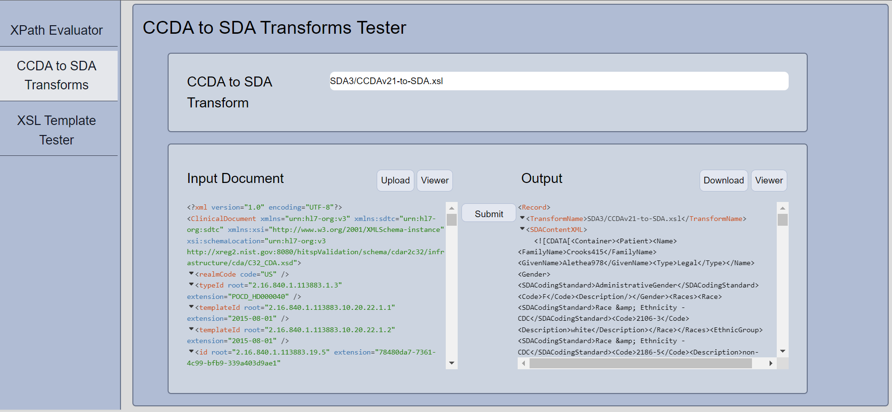

## iris-ccd-devtools

A UI and API for testing CCDA documents against the IRIS XPath Utilities and C-CDA to SDA XSLT code base. 

## Contributors

Chi Nguyen-Rettig (LEAD North)

Nathan Holt (LEAD North)

## Inspiration
To create a user-friendly front-end to organize several testing utilities and methods used to facility CCD transform development

## What it does
Creates /csp/visualizer/service web app in IRIS with endpoints for XPath testing, XSLT testing, and CCD to SDA transform testing. 

<!--
It uses [swagger-ui](https://openexchange.intersystems.com/package/iris-web-swagger-ui) module to provide documentation and test environment for API.
-->

# Getting Started

## Installation with Docker 

## Prerequisites
Make sure you have [git](https://git-scm.com/book/en/v2/Getting-Started-Installing-Git) and [Docker desktop](https://www.docker.com/products/docker-desktop) installed.


Clone/git pull the repo into any local directory e.g. like it is shown below:

```bash
$ git clone git@github.com:LEADNorthLLC/iris-ccd-devtools.git/
```

Open the terminal in this directory and run:

```bash
$ docker-compose up -d --build
```

## Management portal: 

The management portal is available at: 
[Management portal](http://localhost:62773/csp/sys/UtilHome.csp)

```bash
Login: _system/SYS
```
The API is available on localhost:62773/csp/visusalier/service


## CCD DevTools UI:

The UI is served from a second container and is available after docker startup at: 

[CCD DevTools URL](http://localhost:4000)



## REST APIs - TESTING

**Sample Data**
Sample C-CDAs from the [SyntheaMass](https://synthea.mitre.org/downloads) open-source data set have been included in the `testing/sample data` folder for unit testing. 

**Postman export*
An export for a Postman Collection to test the available APIs is located in the **testing** folder of this project. 
Import `Visualizer.postman_collection.json` in Postman to run tests. 

Data set up in the Postman import is also from Synthea. 


# XPath Evaluation Test #
When evaluating CCDs and building transforms, developers need to test an XPATH to see if it's pointing to the expected location. This XPath evaluation uses the same mechanism as the utilities and transformations within IRIS to locate the XPath so a developer can test that the syntax of the XPath is correct. 

[URL](http://localhost:62773/csp/visualizer/service/xpath/) 

```bash
Request-type: POST
Content-type: multipart-form
CONTENT1: {"XPathForEval": "/hl7:ClinicalDocument/hl7:recordTarget/hl7:patientRole/hl7:id[1]/@root"}
CONTENT2: <ClinicalDocument xsi:schemaLocat ..... />
```

Notes: Quoted values in the XPath must use single quotes in order to not mess with JSON parsing
CONTENT2 should contain the entire XML document, no escaping required. 

# CCD to SDA Transform #
A CCD can be passed to a standard CCDA to SDA transform to see the results from the IRIS transformation. 

```bash
[URL](http://localhost:62773/csp/visualizer/service/transform/) 
Request-type: POST
Content-type: multipart-form
CONTENT1: {"TransformName": "SDA3/CCDAv21-to-SDA.xsl"}
CONTENT2: <ClinicalDocument xsi:schemaLocat ..... />
```

Note: CONTENT2 should contain the entire CCD document, no escaping required. 
Possible values for TransformName: 
```bash
SDA3/CCDA-to-SDA.xsl
SDA3/CCDAv21-to-SDA.xsl
SDA3/CDA-toSDA.xsl
SDA3/AU-CDA-to-SDA.xsl
```
# XSL Template Test
Test an isolated XSL template. The contents of the XSL template window will be inserted into an XSL stylesheet that contains the identity template.

```bash
[URL](http://localhost:62773/csp/visualizer/service/xslt/) 
Request-type: POST
Content-type: multipart-form
CONTENT1: <xsl:template match="/hl7:ClinicalDocument/hl7:component/hl7:structuredBody/hl7:component/hl7:section[hl7:templateId/@root='2.16.840.1.113883.10.20.22.2.38']"/>
CONTENT2: <ClinicalDocument xsi:schemaLocat ..... />
```
Note: CONTENT1 contains the entire XSL template, no escaping or single quotes required. CONTENT2 should contain the entire CCD document, no escaping required. 

## Challenges we ran into
The DevTools UI is developed using React. We initially tried to serve the DevTools UI through a web application in IRIS, but it appeared incompatible with Next.js.

While testing, we had to deal with CORS issues due to the cross-origin request. In order to get through the pre-flight request, we have the web application set to Unauthenticated and added %ALL to the Role. 

Due to the use of two docker containers, we were unable to package the solution with ZPM. 

## Built with
Using VSCode and ObjectScript plugin, IRIS for Health Community Edition in Docker, IRIS openapi API, NextJs and React.

## Collaboration 
Any collaboration is very welcome! Fork and send Pull requests!

## 

